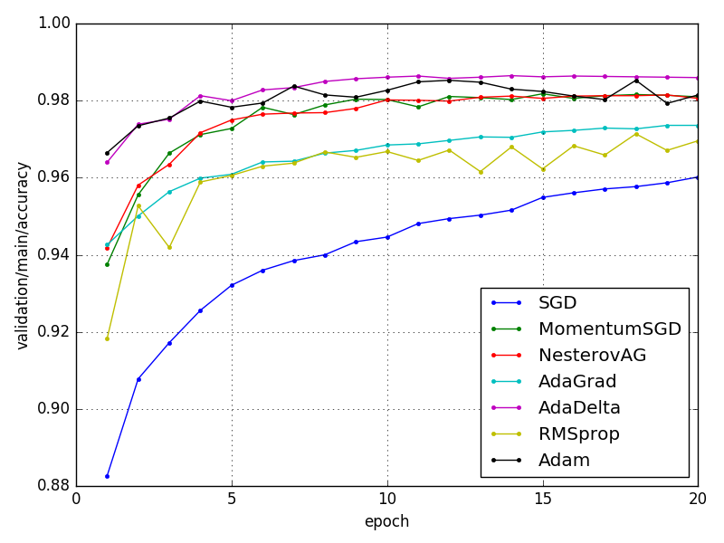
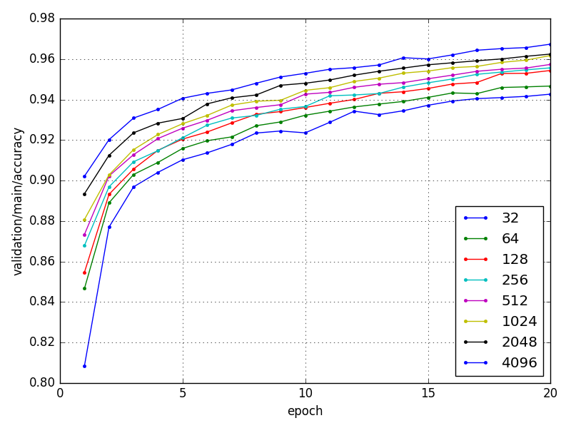
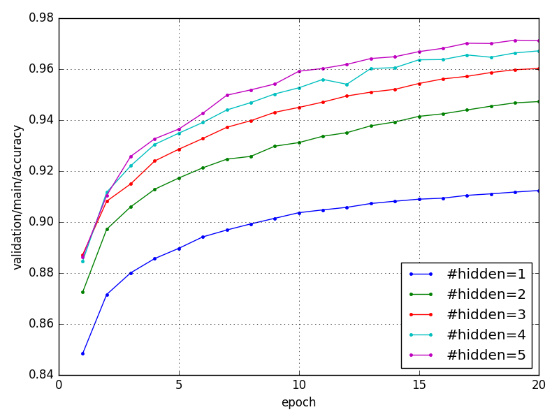
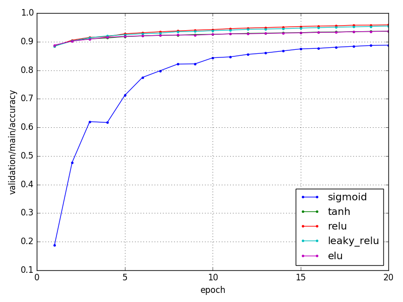
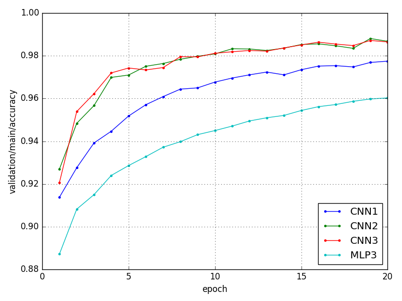

# chainer-mnist

## Overview

- ChainerでMNISTの数字認識分類
- 実行時に最適化手法、モデルアーキテクチャ、活性化関数を指定できるオプションを追加
- 複数の`LogReport`ファイルからグラフを作成する`plotter.py`を追加

## Requirements

- Python 3.5
- Chainer 1.21.0
- matplotlib

## Usage

```
$ python train_mnist.py
```

- すべてデフォルトのオプションで実行
- オプションの意味は`-h (--help)`を参照
- オプションの使用例は`run.sh`を参照

### Options

新たに追加したオプション

- -op (--optimizer)

  - 最適化手法を指定
  - SGD, MomentumSGD, NesterovAG, AdaGrad, AdaDelta, RMSprop, Adamのいずれかを指定

- -m (--model)

  - モデルアーキテクチャを指定
  - MLP1, MLP2, MLP3, MLP4, MLP5, CNN1, CNN2, CNN3のいずれかを指定
  - モデルの詳細は`net.py`で定義

- -a (--activation)

  - 活性化関数を指定
  - MLPモデルでのみ有効
  - sigmoid, tanh, relu, leaky_relu, eluのいずれかを指定

## Results

ニューラルネットの構造を変えたときのバリデーション精度の比較

- 最適化手法

  

- 隠れ層のユニット数

  

- 多層パーセプトロンの隠れ層数

  

- 活性化関数

  

- 畳み込みニューラルネットの深さ

  

## Reference

- [chainer/examples/mnist](https://github.com/pfnet/chainer/tree/master/examples/mnist)

## License

MIT License
